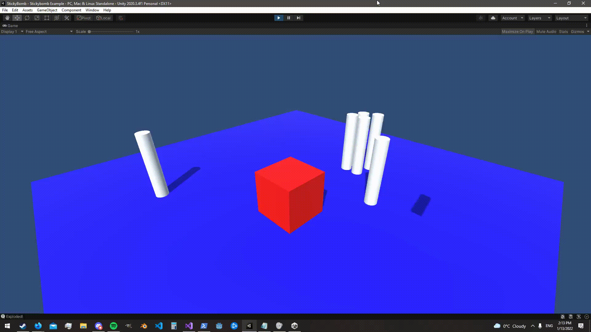

# Sticky Bomb Unity Script

A simple stickybomb script that applies explosion force to nearby rigidbodies, and will play effects/sounds.

Contained in a single script/prefab, and is highly customizable.

# Example

(if you see weird checkerboarding on the gif, its because of video compression)

# Using The Stickybomb
If you just want to use the stickybomb, copy the `Assets/Stickybomb` folder into your project.

It contains a prefab, the Stickybomb.cs file, some materials, a particle effect and a sound.

## What you should know

By itself, the sticky bomb will:

1. When spawned, will move based on physics (fall based on gravity)
2. Attach to the first object it hits, and then explode 1 second later

You should add your own logic for throwing/moving the stickybomb, and spawning it.

## Keep in mind:
 - To attach to an object, the object it should attach to must have a collider.
 - To be effected by explosions from the stickybomb, an object must have a collider and rigidbody.
 - The stickybomb object needs a rigidbody and collider to operate.
 - The sound will only play if an explosion effect is also configured.
 
Feel free to open an issue if you have any questions.

